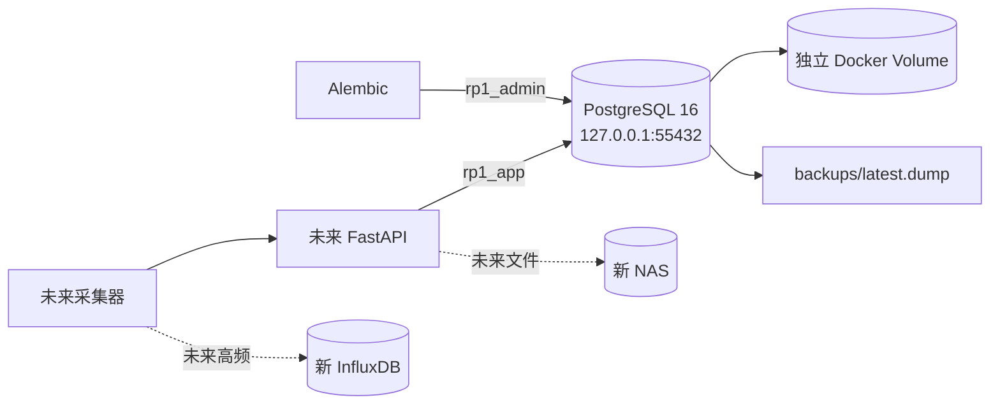

# RP1 PostgreSQL 数据库实施方案

## 1. 目标

建立一套与现有平台完全隔离的 PostgreSQL 16 业务事实库，为整机与模块可靠性、MTBF、F0/F1/F2、长期性能分析、权限、审计和后续 Agent 工具提供唯一业务数据源。

本方案不把高频原始遥测写入 PostgreSQL，也不在本轮迁移旧数据。

## 2. 部署拓扑

隔离要求：

- 不复用现有 PostgreSQL 容器、端口、数据卷或账号。
- 仅绑定主机回环地址。
- 应用账号不是超级用户，不拥有 schema。
- 本轮不连接远程旧库。

## 3. schema 边界

| Schema | 内容 |
|---|---|
| `iam` | 用户、会话、Campaign 授权和 RLS 上下文 |
| `catalog` | 错误码、指标、测试用例、任务标签和健康策略 |
| `test` | 场地、台架、资产、配置、计划、周期、执行、阶段、运行时间和事件 |
| `reliability` | Population、scope、暴露资格、中断、MTBF 计算、当前结论和重算队列 |
| `health` | F0/F1/F2 实例、指标检查点、分段参考点和健康参考群体 |
| `integration` | 数据源、幂等接收、一次性导入批次、旧 ID 映射、文件和保留策略 |
| `audit` | 不可修改的行级变更日志 |

## 4. 关键数据路径

### 4.1 统一测试总时长

`test.runtime_interval` 是测试时长账本：

- `LEGACY_REPORTED`：以后从旧 PostgreSQL 导入的历史汇总时长；只用于累计测试总时长。
- `NATIVE`：新平台真实开始/结束区间。
- `MANUAL`：人工补录区间。

`test.asset_test_time_summary` 对三类来源统一汇总，前端不区分来源。

### 4.2 MTBF 暴露

`reliability.exposure_assessment` 对运行区间进行资格判断。数据库触发器禁止 `LEGACY_REPORTED` 成为 MTBF 有效暴露。

`reliability.exposure_scope_assignment` 允许同一合格区间进入多个 scope，但在每个 scope 内唯一。Stage 与 mission tag 关联，scope 规则版本化。

### 4.3 故障

`test.test_event` 保存事件事实，`reliability.interruption` 保存结构化中断分类。FAILED 必须关联已发布错误码；BLOCKED 必须至少保留原始错误信息。

### 4.4 长期性能

高频数据未来进入 InfluxDB。PostgreSQL 只保存：

- 指标定义和版本；
- F0/F1/F2 检查实例；
- 标准化检查点和派生指标；
- 配置、分析分段、维修/换件事件；
- 正式基线或观察参考点；
- 原始窗口引用和数据质量。

## 5. 身份策略

每个核心实体包含：

- `id bigint GENERATED ALWAYS AS IDENTITY`：内部主键和外键。
- `public_id uuid DEFAULT public.uuid_v7()`：跨存储/API 永久标识。
- 可选业务编号：供人员搜索和沟通。

旧系统 ID 后续进入 `integration.legacy_id_map`。

## 6. 修改和审计

业务数据允许直接更新；关键表使用统一审计触发器，将 `OLD`/`NEW` 行保存为 JSONB。请求必须设置：

- `app.user_id`
- `app.request_id`
- `app.change_reason`

无法提供用户身份的系统任务记录数据库角色和服务来源。`audit.change_log` 通过权限和触发器禁止 UPDATE/DELETE。

## 7. RLS

- 系统管理员：全部 Campaign。
- 测试执行人员：授权 Campaign 内读写。
- 查看者：授权 Campaign 内只读。
- 资产通过 `test.campaign_asset` 进入授权范围。
- Catalog 面向登录用户可读；维护能力按固定角色授权。
- 审计日志只对系统管理员开放。

RLS 是后端鉴权之外的第二道边界。后端事务必须先设置可信请求上下文。

## 8. 索引策略

- 所有外键建立 B-tree 索引。
- 等值列在复合索引前，时间范围列在后。
- 活跃/未作废记录使用 partial index。
- 事件、审计、指标检查点按实体和时间建立降序索引。
- JSONB 只在确定存在包含查询的位置建立 GIN，避免无差别索引。
- 运行区间使用 GiST 排他约束防止同一样品时间重叠。
- 当前规模不提前分区；当单表超过约一千万行或实际压测显示需要时再按时间分区。

## 9. 计算和队列

PostgreSQL 保存事实、当前计算快照和任务队列，不在数据库触发器中执行复杂统计公式。

- 数据变更提交重算任务。
- Worker 使用 `FOR UPDATE SKIP LOCKED` 领取任务。
- `current_mtbf_result` 保存最近完成结果。
- `current_conclusion` 保存前端唯一当前正式结论。
- 目标日常延迟不超过 5 秒。
- 批量变化时显示计算中，由后台合并同一资源的重复任务。

## 10. 实施阶段

1. 启动独立 PostgreSQL 容器和角色。
2. 执行 Alembic 基线迁移。
3. 写入最小系统种子：任务标签、整体 scope、默认统计方法占位和保留策略。
4. 验证表、约束、索引、RLS、审计、队列和备份恢复。
5. 后续单独设计旧 PostgreSQL 一次性导入，不影响本基线。

## 11. 本轮验收

- 七个 schema 和核心表存在。
- 应用账号无超级用户、建库或建角色权限。
- 查看者不能更新；测试执行人员只能更新授权 Campaign；管理员可访问全部。
- 模块不能加入整机 Campaign/Population。
- 旧历史时长可进入测试总时长，但不能成为 MTBF 暴露。
- FAILED 无正式错误码时被数据库拒绝。
- 同一样品本地运行区间重叠时被拒绝。
- 关键行修改自动生成 before/after 审计。
- 审计日志不能更新或删除。
- 队列可以通过 `SKIP LOCKED` 安全领取。
- 备份成功后原子替换唯一的 `latest.dump`，且可恢复到空库。

