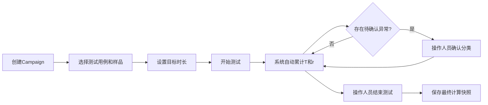

# RP1 MTBF 自动计算后端契约 V1

状态：已按“少流程、自动计算、测试用例驱动”原则修订  
日期：2026-09-17  
统计实现键：`mtbf.poisson.exposure_estimate.v1`

> 本契约取代此前固定3台、每台620 h、总1860 h及复杂正式评定流程的设计。系统定位为专业MTBF自动计算工具，不是审批流程系统。本轮只更新设计文档，不修改业务代码、SQL迁移或数据库。

## 1. 设计目标

系统只解决四件事：

1. 根据测试用例自动确认有效运行时长；
2. 对重叠、排除和异常时间进行专业处理；
3. 按独立相关故障计算整数故障数`r`；
4. 实时计算MTBF点估计和70%/90%单侧置信下限。

操作人员日常只需要：选择测试用例和样品、处理少量系统无法判断的异常、按需要结束测试。样品数量、实际时长和配置调整不由系统硬编码限制。

## 2. 简化业务流程



Campaign继续使用现有状态：`PLANNED`、`ACTIVE`、`PAUSED`、`CLOSED`、`CANCELLED`。不新增G0/G1/G2、Readiness、Hold、四道门和多层发布状态机。

## 3. 测试创建规则

### 3.1 测试用例驱动

`test.test_campaign`直接作为一次MTBF计算的业务容器。Campaign通过现有`test.campaign_coverage_item`关联一个或多个`test_case_version`。

测试用例定义：

- 哪些任务或stage属于有效运行；
- 哪些时间应排除；
- 哪些错误码可自动判为相关或非相关；
- 需要展示的性能指标；
- 可选的目标测试时长；
- 可选的特殊停止规则。

系统不全局固定样品数量。参加计算的样品来自现有`test.campaign_asset`，操作人员可以根据测试用例和现场情况增加、退出或更换样品，历史数据不删除。

### 3.2 目标时长

- 默认目标可设为1000 h，但必须允许创建时修改或留空。
- 目标时长只用于进度显示，不进入MTBF公式。
- 达到目标不自动停止、不截尾，也不自动给出PASS/FAIL。
- 实际有效运行多少就显示和计算多少；超过目标继续累计。

示例：目标1000 h，实际有效运行1126.4 h，则进度显示112.64%，计算使用`T=1126.4 h`。

## 4. 专业有效时长T

### 4.1 数据来源

继续复用现有结构：

- `test.runtime_interval`：原始运行区间；
- `reliability.exposure_assessment`：区间是否具备MTBF计算资格；
- `reliability.exposure_scope_assignment`：区间在OVERALL、FACTORY_LOAD等scope中是INCLUDED、EXCLUDED还是PENDING；
- `test.execution_stage`和`stage_mission_tag`：根据测试用例自动归属任务。

不新增`exposure_slice`和复杂暴露审批账本。需要切分时，由采集/归一化服务把原始运行记录切成多个`runtime_interval`。

### 4.2 自动确认规则

系统按测试用例自动处理：

| 情况 | 默认处理 |
|---|---|
| 测试用例规定任务内的正常运行 | INCLUDED |
| 规定的自动自检、任务切换、受控恢复 | INCLUDED |
| 充电、维修、等待备件、人工停机检查 | EXCLUDED |
| 外部断电、台架故障、外部网络问题 | EXCLUDED |
| 环境超出测试用例允许范围 | EXCLUDED |
| 数据不足、任务标签冲突、原因无法判断 | PENDING，提醒操作人员确认 |
| 旧系统只有汇总时长的`LEGACY_REPORTED` | 只进入累计测试总时长，不进入MTBF有效T |

同一样品、同一scope的区间按半开区间`[start_at,end_at)`求并集，防止重复计时。不同样品的有效时长可以累加。

### 4.3 T的计算

```text
T_i = 样品i在当前Campaign和scope内去重后的INCLUDED有效秒数 / 3600
T   = Σ T_i
```

目标时长不对`T_i`或`T`截尾。API同时返回：

- `total_test_duration_hours`：全部累计测试时长；
- `runtime_hours`：有实际运行记录的时长；
- `eligible_exposure_hours`：用于MTBF公式的T；
- `excluded_hours`：明确排除时间；
- `pending_hours`：仍需人工确认时间；
- `per_asset_exposure[]`：每台样品的有效时长明细。

PENDING时间暂不进入T，但不阻止系统继续给出“基于当前已确认数据”的实时估计；页面必须同时显示待确认时长，避免把暂估值误认为完整结果。

## 5. 相关故障数r

### 5.1 复用现有中断模型

继续使用：

- `test.test_event`保存原始事件；
- `reliability.interruption`保存`FAILED`、`BLOCKED`和`NON_RELEVANT`分类；
- `interruption_error_code`保存主错误码和伴随错误码；
- `interruption_scope_assignment`保存故障属于哪些MTBF scope。

V1只需给`interruption`增加一个可空的`failure_group_key`：

- 同一根因导致的多个事件使用同一个group key，只计1次；
- 不同独立根因使用不同group key，各计1次；
- 同一未修复根因重复触发继续使用原group key；
- 修复后再次发生时，由操作人员创建新的group key；
- 单一独立故障未填写group key时，使用该interruption的`public_id`作为默认分组。

### 5.2 自动与人工分类

| 情况 | 默认处理 |
|---|---|
| 已发布错误码明确属于内部相关故障 | 自动建议FAILED |
| 外部断电、台架、外部网络、操作员主动停止 | 自动建议NON_RELEVANT |
| 未知内部错误或责任不清 | BLOCKED，提醒操作人员确认 |
| 多条报警疑似同一根因 | 系统建议合并group，人员可调整 |

正式计算只使用当前确认结果：

```text
r = 当前Campaign和scope中，
    classification=FAILED、review_status已确认的不同failure_group_key数量
```

`r`必须为非负整数，不能使用报警条数、严重度权重或小数。BLOCKED不进入r，但页面显示待确认故障数。

## 6. MTBF与置信下限

### 6.1 点估计

设`T`为当前已确认的有效暴露小时，`r`为独立相关故障数：

```text
r > 0:  MTBF_hat = T / r
r = 0:  MTBF_hat = NULL
```

当`r=0`时，页面显示：

```text
累计无相关故障有效运行：T h
MTBF点估计：不作有限估计
```

禁止显示`∞`、`NaN`、极大占位值或把T直接命名为“真实MTBF”。

### 6.2 单侧置信下限

对置信度`C`：

```text
q_C = chi_square_ppf(C, df = 2 * (r + 1))
MTBF_lower_C = 2 * T / q_C
```

当`r=0`时可使用等价闭式：

```text
MTBF_lower_C = T / [-ln(1-C)]
```

系统默认计算并显示70%和90%单侧下限。置信下限用于表达当前估计的不确定性，不自动产生接收或拒收结论。

### 6.3 计算边界

- `T>=0`；`r`必须是非负整数；置信度满足`0<C<1`。
- `T=0,r=0`返回“尚无有效暴露”。
- `T=0,r>0`属于输入不一致，应拒绝计算并提示数据检查。
- 秒到小时按`3600`精确换算；展示舍入不能反向影响计算。
- 样品数量不影响公式；多样品只是把各自有效暴露累加到T。
- 不计算固定抽样方案的alpha/beta，不内置`r<=2`通过或`r>=3`拒收。

### 6.4 数值回归向量

以下只用于验证计算实现，不代表接收门槛：

| T | r | 点估计 | 70%下限 | 90%下限 |
|---|---:|---:|---:|---:|
| 1860 h | 0 | NULL | 1544.8853938535195 h | 807.7877363400484 h |
| 1860 h | 1 | 1860 h | 762.5399437686290 h | 478.1834987536888 h |
| 1860 h | 2 | 930 h | 514.4420383996598 h | 349.4716367930763 h |
| 1860 h | 3 | 620 h | 390.5733979394185 h | 278.4104768852472 h |

小时结果容差：相对误差`<=1e-10`或绝对误差`<=1e-6 h`，取较宽者。

## 7. 配置变化与样品调整

- 软件、小结构、参数和同规格部件变化默认不清零、不重置T或r。
- 继续使用现有`configuration_snapshot`、`configuration_change`和`analysis_segment`记录变化点。
- 曲线在变化前后使用不同segment显示，但保持完整历史。
- 操作人员可以增加、退出或更换Campaign样品；系统按样品实际参与时段计算，不删除旧样品数据。
- 如果某个测试用例确实要求变化后重新累计，由该测试用例明确配置排除规则，不设置全局C0—C3流程。

## 8. 权限与自动化

继续使用现有三类全局角色和Campaign授权，不新增plan capability体系：

- VIEWER：查看授权Campaign及计算结果；
- TEST_EXECUTOR：创建/执行测试、补录和修正区间、分类故障、调整group、修改配置记录、结束测试；
- SYSTEM_ADMIN：用户、数据源、系统配置和正式报告发布。

正常区间、scope归属和计算由系统自动完成，无需逐条人工批准。人工只处理PENDING区间、BLOCKED故障和明显错误数据。所有修改继续写入现有`audit.change_log`。

正式报告如果需要发布，继续使用现有`current_conclusion`和SYSTEM_ADMIN权限；普通实时MTBF看板不要求双人审批或正式结论流程。

## 9. 最小数据库改动

### 9.1 复用现有结构

直接复用以下现有表，不新建对应替代物：

- `test.test_campaign`、`campaign_asset`、`campaign_coverage_item`；
- `test.runtime_interval`、`test_event`、`configuration_snapshot/change`；
- `reliability.mtbf_population`、`mtbf_scope`、`mtbf_scope_rule`；
- `exposure_assessment`、`exposure_scope_assignment`；
- `interruption`、`interruption_error_code`、`interruption_scope_assignment`；
- `statistics_method`、`calculation_run`、`current_mtbf_result`、`recompute_job`；
- 现有RLS、审计和`SKIP LOCKED`领取函数。

不新增`mtbf_test_plan`、`plan_evaluation`、`plan_member`、`member_selection_revision`、`exposure_slice`、`failure_case`、四门、Readiness、Hold、状态事件、plan capability或结论revision等表。

### 9.2 唯一新增表

新增`reliability.campaign_mtbf_config`：

| 字段 | 含义 |
|---|---|
| `campaign_id` | 现有Campaign |
| `scope_id` | OVERALL、FACTORY_LOAD等计算scope |
| `method_id` | `mtbf.poisson.exposure_estimate.v1` |
| `target_seconds` | 可空；默认可由前端/测试用例填1000 h，仅用于进度 |
| `confidence_levels` | 默认`[0.70,0.90]` |
| `enabled` | 是否启用该scope实时计算 |
| `settings` | 少量测试用例覆盖参数，不保存核心计算结果 |

主键/唯一约束为`(campaign_id,scope_id)`。

### 9.3 最少字段扩展

| 表 | 增加/调整 |
|---|---|
| `reliability.interruption` | 增加可空`failure_group_key text`及索引 |
| `reliability.calculation_run` | 增加直接的`campaign_id`、`knowledge_as_of_at`、`implementation_version`；输出继续使用现有`output_summary` |
| `reliability.current_mtbf_result` | 增加`campaign_id`、`excluded_exposure_seconds`、`lower_70_hours`、`lower_90_hours`；唯一键调整为`(campaign_id,scope_id)` |
| `reliability.recompute_job` | 增加可选`scope_id`和幂等`job_key`；同一Campaign/scope的重复任务可合并 |

每台样品的T、排除原因分布和待确认列表可先保存在`result_payload/input_summary/evidence_summary`中，避免为低频明细增加新表。核心总T、r、点估计和70%/90%下限保持结构化列。

### 9.4 现有逻辑调整

1. `calculation_run`和`current_mtbf_result`从“population/scope全局结果”调整为“campaign/scope结果”。
2. 重算触发器继续监听runtime、exposure、interruption和metric变化，并把任务定位到受影响Campaign/scope。
3. Worker计算步骤固定为：读取配置→汇总有效区间→按failure group计算r→计算点估计和置信下限→原子更新current结果。
4. `004_system_seed.sql`后续新增正式方法`mtbf.poisson.exposure_estimate.v1`；不原位修改`UNCONFIGURED`占位记录。
5. 旧历史汇总时长继续只进入累计测试总时长，不改变现有约束。

## 10. 简化API契约

基础路径：`/api/v1`。

| 方法与路径 | 用途 |
|---|---|
| `PUT /campaigns/{campaignId}/mtbf-config/{scopeCode}` | 启用/修改目标时长、置信度和方法 |
| `GET /campaigns/{campaignId}/mtbf/{scopeCode}` | 获取当前T、r、MTBF、置信下限、目标进度和待确认数量 |
| `GET /campaigns/{campaignId}/mtbf/{scopeCode}/time-breakdown` | 查看每台样品、INCLUDED/EXCLUDED/PENDING明细 |
| `GET /campaigns/{campaignId}/mtbf/{scopeCode}/failures` | 查看计数故障组和BLOCKED项 |
| `PATCH /interruptions/{interruptionId}` | 调整分类、review状态和failure group |
| `POST /campaigns/{campaignId}/mtbf/{scopeCode}/recalculate` | 手动请求重算；正常情况由系统自动触发 |
| `GET /calculation-runs/{runId}` | 查看固定计算快照和输入摘要 |

所有写请求继续携带`X-Request-Id`和`Idempotency-Key`。没有权限返回403；并发修改返回409；无效r、T或置信度返回422。

当前结果响应至少包括：

```json
{
  "data": {
    "campaign_id": "...",
    "scope": "OVERALL",
    "target_hours": 1000,
    "progress_percent": 112.64,
    "eligible_exposure_hours": 1126.4,
    "relevant_failure_count": 1,
    "pending_failure_count": 0,
    "mtbf_point_estimate_hours": 1126.4,
    "mtbf_lower_70_hours": 461.7,
    "mtbf_lower_90_hours": 289.5,
    "excluded_hours": 84.2,
    "pending_hours": 3.5,
    "calculated_at": "..."
  }
}
```

示例中的置信下限仅说明返回结构，实际数值必须由统一统计实现计算，不能硬编码。

## 11. 精简验收测试

| ID | 场景 | 期望 |
|---|---|---|
| M01 | 1台、2台或5台样品 | 均可创建和计算，不检查固定样品数 |
| M02 | 目标1000 h，实际1126.4 h | 显示112.64%，T使用1126.4 h，不截尾 |
| M03 | 未设置目标时长 | 正常计算T/r，只不显示进度百分比 |
| T01 | 同一样品区间重叠 | 求并集去重，不重复计时 |
| T02 | 充电、维修、外部中断 | 自动EXCLUDED并保留原因 |
| T03 | 任务或数据无法确认 | PENDING不进入T，但实时结果继续显示并标注暂估 |
| T04 | `LEGACY_REPORTED` | 进入累计测试总时长，不进入有效T |
| F01 | 同一根因产生多个中断 | 相同group key，r只计1 |
| F02 | 两个独立根因 | 不同group key，r计2 |
| F03 | BLOCKED或NON_RELEVANT | 不进入r；BLOCKED显示待确认 |
| S01 | `T=1860 h,r=0/1/2/3` | 结果分别匹配第6.4节金标准，不产生自动PASS/FAIL |
| S02 | r为负数、小数或严重度权重 | 拒绝计算 |
| S03 | `T=0,r=0`与`T=0,r>0` | 前者返回无数据；后者报输入不一致 |
| C01 | 软件/小结构变化 | 默认继续累计，曲线创建segment标记 |
| A01 | 数据新增、故障改判或group调整 | 自动入队并更新current结果 |
| A02 | 同一幂等键重试 | 不重复创建任务或重复计算结果 |
| P01 | VIEWER尝试修改 | 403；TEST_EXECUTOR在授权Campaign内可处理异常 |

## 12. 实现顺序

1. 新建一个小型Alembic迁移：`campaign_mtbf_config`、`failure_group_key`及计算结果字段扩展。
2. 实现`mtbf.poisson.exposure_estimate.v1`纯计算函数和金标准测试。
3. 实现Campaign/scope有效时长聚合、区间去重和failure group计数。
4. 调整现有重算任务，使数据变化后自动计算并更新current结果。
5. 实现7个简化API和大屏结果接口。
6. 最后接入语音/文字Agent；Agent调用读取和异常建议接口，不新增审批流程。

## 13. 非阻塞实现假设

- 具体卡方数值库由实现阶段选择，但必须通过第6.4节回归向量。
- InfluxDB/NAS尚未接入时，PostgreSQL先使用现有时间事实和artifact指针。
- 1000 h是默认展示目标，不是标准强制值，也不是MTBF结果。
- 若未来确有外部认证或固定抽样接收需求，应作为独立“正式评定模式”新增，不反向增加当前普通测试人员的操作步骤。

